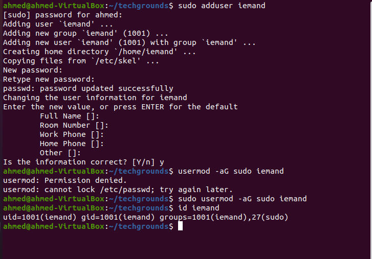
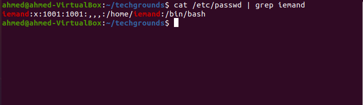

# Users & Groups

Linux has users, similar to accounts on Windows and MacOS. Every user has their own home directory. Users can also be part of groups.
There is a special user called ‘root’. Root is allowed to do anything.
To gain temporary root permissions, you can type ‘sudo’ in front of a command, but that only works if you’re allowed to do that.
Some actions require (root) permissions.
Users, passwords, and groups are all stored in  (different) files across the system.

## Opdracht

1. Create a new user in your VM. 
    - The new user should be part of an admin group that also contains the user you created during installation.
    - The new user should have a password.
    - The new user should be able to use ‘sudo’

2. Locate the files that store users, passwords, and groups. See if you can find your newly created user’s data in there.

### Gebruikte bronnen

https://www.cyberciti.biz/faq/add-new-user-account-with-admin-access-on-linux/
https://www.cyberciti.biz/faq/where-are-the-passwords-of-the-users-located-in-linux/

### Ervaren problemen

Geen

### Resultaat

Na het afmaken van de opdrachten loop ik de stappen terug zodat ik zeker weet dat ik alles heb toegevoegd, Daarna aan mijn groep laten zien.

