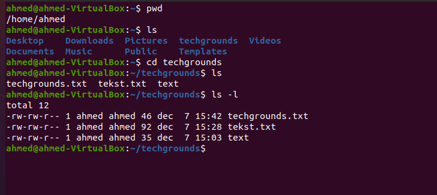
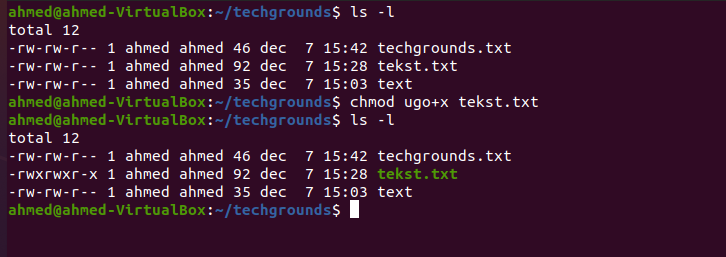
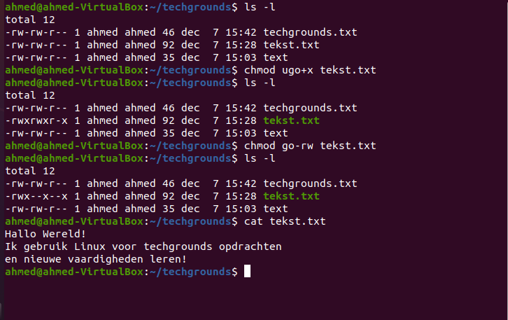
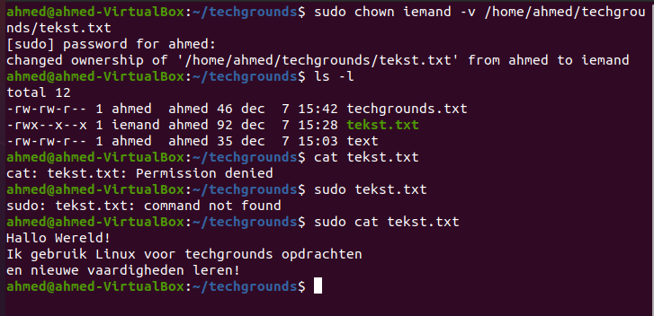
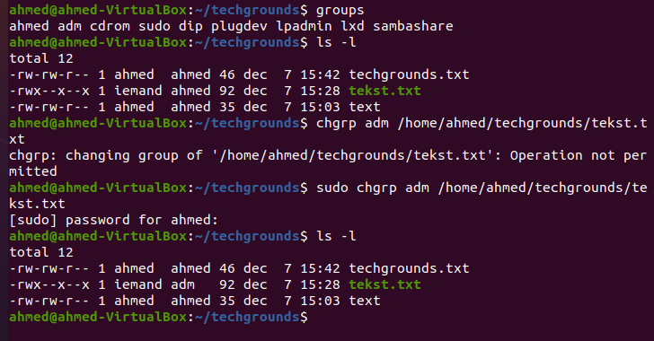

# File permissions

Elk bestand of elke directory op een linux machine is eigendom van een specifieke user of group. Bijgevolg worden bestandsrechten apart gedefinieerd voor “user/owner”, “group” en “others”

    

## Key-terms

- User: De gebruiker die eigenaar is van het bestand. Standaard zal de gebruiker die het bestand aanmaakt ook eigenaar worden.

- Group: De gebruikersgroep die eigenaar is van het bestand. Alle gebruikers die behoren tot deze gebruikersgroep zullen dezelfde rechten/toegang hebben op het bestand. Dit is bijvoorbeeld nuttig als je werkt aan een project waar meerdere gebruikers toegang tot moeten hebben; voeg de gebruikers toe aan een groep en zorg er vervolgens voor dat de bestanden en mappen van het project eigendom zijn van deze groep.

- Other: Een gebruiker die geen eigenaar is van het bestand en die niet tot dezelfde groep behoort als het bestand. Kortom alle andere gebruikers dus.

- Read Permission: Wil zeggen dat het bestand geopend en gelezen kan worden of dat de inhoud opgelijst kan worden als het een directory betreft en als de execute rechten aanwezig zijn.

- Write Permission: Wil zeggen dat het bestand kan gewijzigd/overschreven worden of dat er bestanden kunnen toegevoegd, hernoemd of verwijderd worden als het om een directory gaat.

- Execute Permissions: Wil zeggen dat het bestand uitgevoerd kan worden als een programma of script of dat je toegang hebt tot bestanden of submappen in deze directory. Wees er echter van op de hoogte dat execute rechten op een directory niet volstaan om de inhoud hiervan op te lijsten. Hiervoor heb je dus ook read rechten nodig.

## Opdracht

- Make a long listing to view the file’s permissions. Who is the file’s owner and group? What kind of permissions does the file have?.

- Make the file executable by adding the execute permission (x).

- Remove the read and write permissions (rw) from the file for the group and everyone else, but not for the owner. Can you still read it?

- Change the owner of the file to a different user. If everything went well, you shouldn’t be able to read the file unless you assume root privileges with ‘sudo’.

- Change the group ownership of the file to a different group.

### Gebruikte bronnen

- https://askubuntu.com/questions/528411/how-do-you-view-file-permissions
- https://askubuntu.com/questions/6723/change-folder-permissions-and-ownership
- https://linuxize.com/

### Ervaren problemen

Geen

### Resultaat

Na het afmaken van de opdrachten loop ik de stappen terug zodat ik zeker weet dat ik alles heb toegevoegd, Daarna aan mijn groep laten zien ten bevestiging maar ook als er fouten zijn gemaakt.
