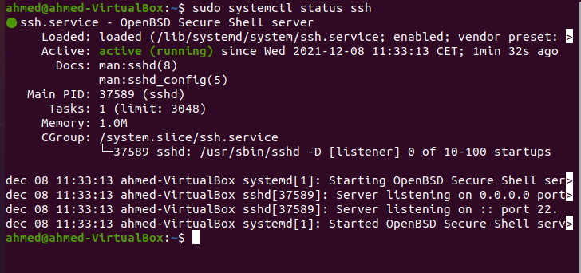
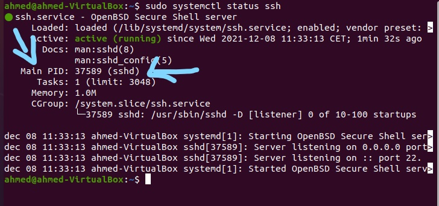
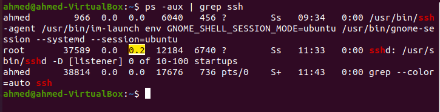
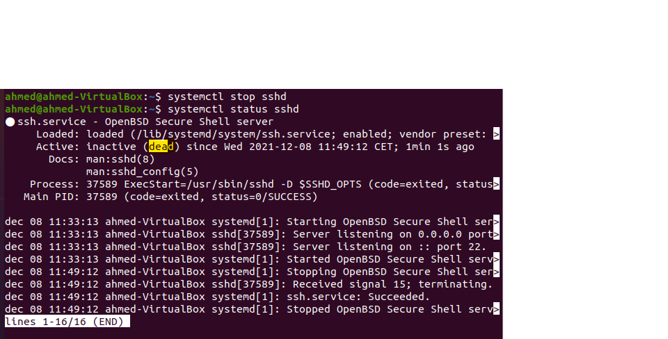

# Processes

Alles wat op een Linux-systeem gebeurt, is in de vorm van een proces; een taak die door het besturingssysteem gestart wordt en processorcapaciteit claimt.

Er kunnen in principe 2 soorten processen actief zijn:
1. De processen die door de computer tijdens het opstarten geactiveerd worden zoals init, syslogd, etc. Deze automatisch bij het opstarten geactiveerde processen noemen we deamons.
2. De tweede soort zijn de interactieve processen die door de gebruikers opgestart worden door een commando in te typen. Elk commando veroorzaakt een proces, het is de enige manier om systeembronnen van de kernel te vragen.

Alle processen hebben een Proces-ID waarmee het bij de kernel bekend is. Ook om procesbeheer, zoals het uitschakelen, uit te voeren moet gebruik gemaakt worden van dit PID. Dit nummer wordt toegekend in de volgorde van opstarten.
PID 1 is altijd het proces 'init', de moeder van alle processen, elk ander proces komt namelijk voort uit 'init'.
Voor een overzicht van alle active processen is het commando # ps aux of voor een continue update # top .

## Key-terms

- Proces INIT proces
    Het proces init is het belangrijkste op een Linux computer.
    Tijdens het opstarten van de computer zorgt Lilo of Grub ervoor dat de kernel geactiveerd wordt. Als de kernel geladen is zorgt deze er voor dat 'init' met PID 1 gestart wordt.
    Init bepaald wat er vervolgens met het systeem gebeurt en zorgt er ook voor dat alle andere processen gestart kunnen worden. Hierbij wordt het instellingenbestand '/etc/inittab' gebruikt. Klik hier om een voorbeeld te openen.
    In 'inittab' wordt onder andere geregeld in welk runlevel de computer actief wordt. Per runlevel wordt bepaald welke processen al dan niet geactiveerd worden en worden de relevante opstartscripts ter initialisering van het systeem uitgevoerd.

## Opdracht

- Start the ssh daemon.

    Om ssh te installeren en starten gebruiken we de volgende command:
    
        $ sudo apt update
        $ sudo apt install openssh-server

    Om te veriferen dat ssh daemon aktief is gebruiken we de volgende command:

        $ sudo systemctl status ssh

    

- Find out the PID of the ssh daemon.

    Om informatie te vinden over een bepaalde daemon (ssh bijvoorbeeld) gebruiken we de volgende command:

        $ sudo systemctl status ssh

    Zo kunnen we ook weten wat de PID van ssh daemon is.

    

- Find out how much memory the sshd is using.

    Wij gebruiken de command "$ ps -aux" om alle aktieve daemons te bekijk en informatie te vinden. Om te filteren gebruiken we de option "grep". 

    Om informatie te halen over een bepaalde daemons in dit geval ssh, gebruiken we de volgende command:

        $ ps -aux | grep ssh

    Hier onderaan is de resultaat. In het gemarkeerd is te zien hoeveel memory het daemon ssh gebruikt.

    

- Stop or kill the sshd process.

    Om onze ssh daemon (Process) te stoppen gebruiken we de volgende command:

        $ systemctl stop sshd

    Om te veriferen dat ons sshd gestopt is gebruiken we de volgende command:

        $ sudo systemctl status sshd

     

### Gebruikte bronnen

- https://www.makkink.eu/exploringlinux/server7/html/processen.html
- https://www.youtube.com/watch?v=wOWhfNB_r-0&t=1212s
- https://linuxize.com/post/how-to-enable-ssh-on-ubuntu-18-04/

### Ervaren problemen

Geen

### Resultaat

Na het afmaken van de opdrachten loop ik de stappen terug zodat ik zeker weet dat ik alles heb toegevoegd, Daarna aan mijn groep laten zien ten bevestiging maar ook als er fouten zijn gemaakt.
