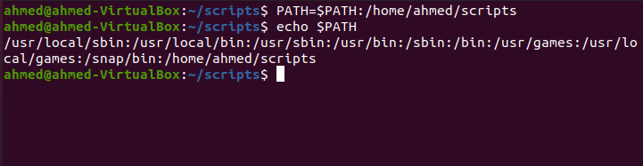
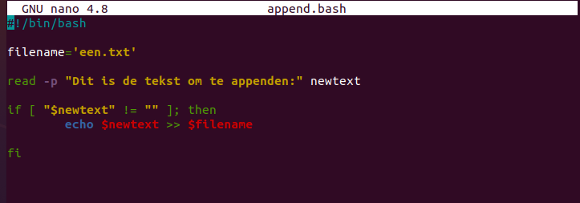
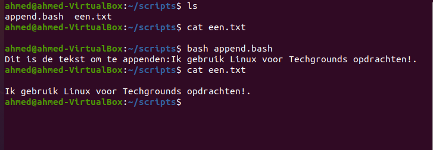
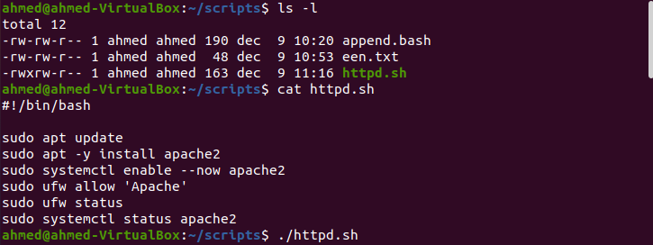
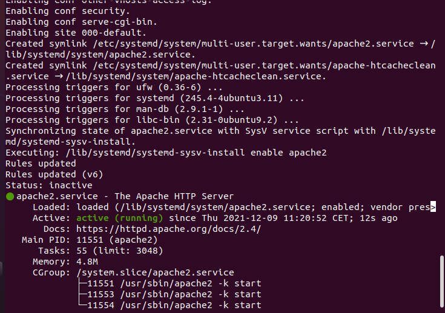
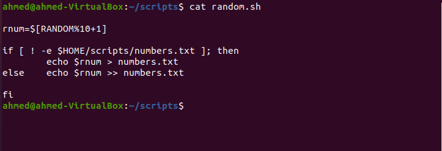
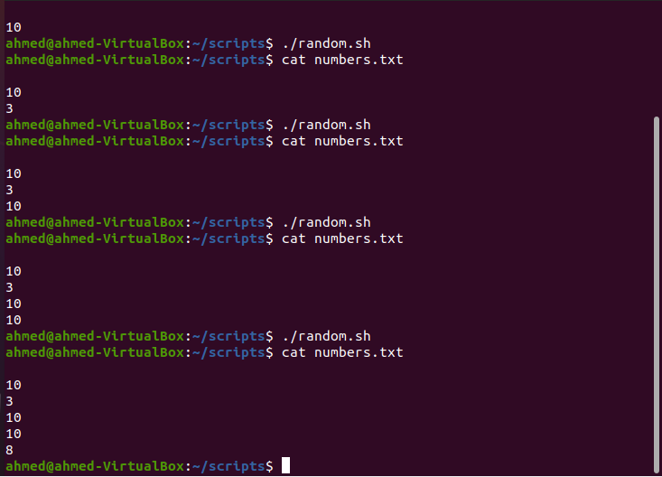
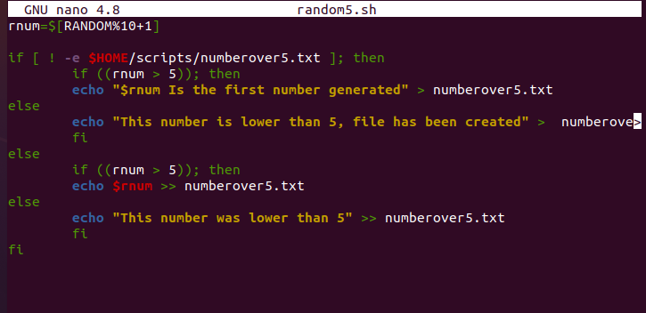
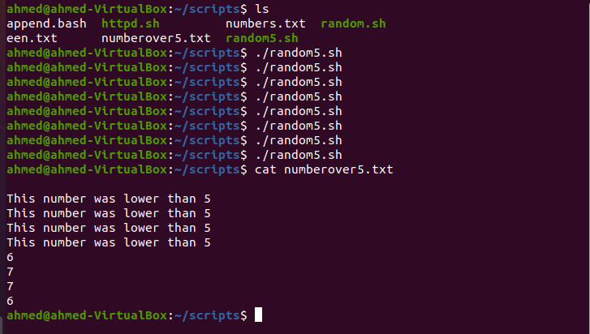

# Bash Scripting

Bash is een opdrachtverwerkingsprogramma (command interpreter). Het is een programma dat je opdrachten interpreteert en voor verwerking aan het besturingssysteem doorgeeft. Via de opdrachten die je aan bash doorgeeft zal de kernel programma's starten en stoppen.

## Key-terms

- Shell 
    de interactieve gebruikersinterface (schil) rondom een centrale kern(el).

- Variable
    Een variable is een plek in het geheugen van een computer waar je een bepaalde waarde in op kunt slaan.

## Opdracht 1

- Create a directory called ‘scripts’. Place all the scripts you make in this directory.

        $ mkdir Scripts

  

- Add the scripts directory to the PATH variable.

        $ PATH=$PATH:/directory locatie/scripts
        $ echo $PATH

    

- Create a script that appends a line of text to a text file whenever it is executed.

        $ nano append.bash

    Het script word toegevoegd in append.bash

    

    Om het script te starten gebruiken we de volgende command:

        $ bash append.bash
    
    En dit is het resultaat:

    

- Create a script that installs the httpd package, activates httpd, and enables httpd. Finally, your script should print the status of httpd in the terminal.

    
    

## Opdracht2

- Create a script that generates a random number between 1 and 10, stores it in a variable, and then appends the number to a text file.

    Voor deze opdracht heb ik mijn vorige script gebruikt("ongeveer") en aangepast.

    

    En dit is het resultaat:

        

## Opdracht 3

- Create a script that generates a random number between 1 and 10, stores it in a variable, and then appends the number to a text file only if the number is bigger than 5. If the number is 5 or smaller, it should append a line of text to that same text file instead.
    
    
    
    

### Gebruikte bronnen
- https://www.youtube.com/watch?v=0MjWG-Z50sU
- https://appuals.com/set-bash-variables-random-numbers/
- https://stackoverflow.com/questions/1262903/add-to-file-if-exists-and-create-if-not

### Ervaren problemen

De bovenste 3 opdrachten vond ik moeilijk. Met vragen aan mede studenten en goed googlen is het uiteindelijk mij gelukt.

### Resultaat

Na het afmaken van de opdrachten loop ik de stappen terug zodat ik zeker weet dat ik alles heb toegevoegd, Daarna aan mijn groep laten zien ten bevestiging maar ook als er fouten zijn gemaakt.