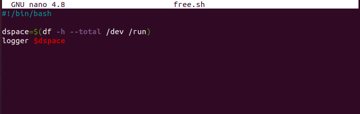

# Cron Jobs

Een Cronjob of crontab is een Unix commando dat een programma of script op een ingesteld tijdstip uitvoert. Cronjobs worden gebruikt in Unix-achtige systemen als Linux, BSD en Apple Macintosh. Het woord 'cron' is afkomstig van het Engelse woord chronograph, dat een soort stopwatch is. Later is hier job (taak) aan toegevoegd. Een cronjob die een systeem service draait wordt een daemon genoemd. Dit zijn meestal servertoepassingen.

## Opdracht

- Create a Bash script that writes the current date and time to a file in your home directory.

        IF [ ! -e $HOME/date.txt ] ; then
            date +"%A, %d %b, %Y %H:%M:%S" > $HOME/date.text
        else
            date +"%A, %d %b, %Y %H:%M:%S" >> $HOME/date.text
        fi

    

- Register the script in your crontab so that it runs every minute.

        crontab -e
        * * * * * $HOME/scripts/date.sh

    
       

- Create a script that writes available disk space to a log file in ‘/var/logs’. Use a cron job so that it runs weekly.

    

### Gebruikte bronnen

- https://stackoverflow.com/questions/43221469/write-current-date-time-to-a-file-using-shell-script
- https://www.youtube.com/watch?v=UlVqobmcPuM
<<<<<<< HEAD
- https://nl.wikipedia.org/wiki/Cronjob
- https://ubuntu.com/tutorials/viewing-and-monitoring-log-files#2-log-files-locations
=======
>>>>>>> 7f02ac1d2abbe4d779f0b16a7d05bf7f7e708061

### Ervaren problemen

In het begin wist ik niet zeker of mijn script werkt bij opdracht 3 maar uiteindelijk is het mij gelukt.

### Resultaat

Na het afmaken van de opdrachten loop ik de stappen terug zodat ik zeker weet dat ik alles heb toegevoegd, Daarna aan mijn groep laten zien ten bevestiging maar ook als er fouten zijn gemaakt.
