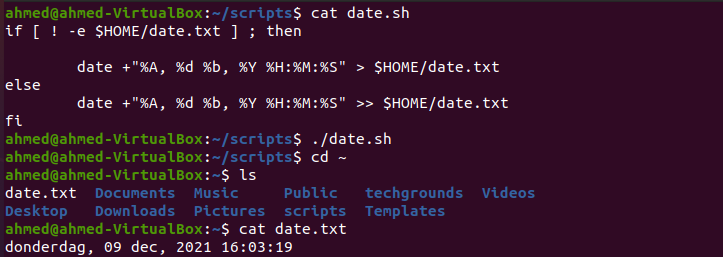
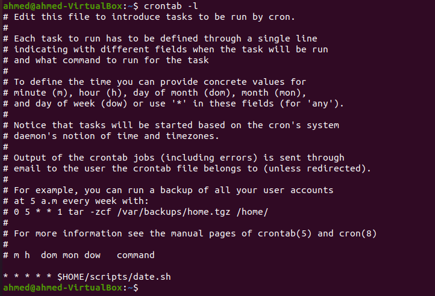

# Cron Jobs
[Geef een korte beschrijving van het onderwerp]

## Key-terms
[Schrijf hier een lijst met belangrijke termen met eventueel een korte uitleg.]

## Opdracht

- Create a Bash script that writes the current date and time to a file in your home directory.

        IF [ ! -e $HOME/date.txt ] ; then
            date +"%A, %d %b, %Y %H:%M:%S" > $HOME/date.text
        else
            date +"%A, %d %b, %Y %H:%M:%S" >> $HOME/date.text
        fi
        
    

- Register the script in your crontab so that it runs every minute.

    
        
### Gebruikte bronnen

- https://stackoverflow.com/questions/43221469/write-current-date-time-to-a-file-using-shell-script

### Ervaren problemen
[Geef een korte beschrijving van de problemen waar je tegenaan bent gelopen met je gevonden oplossing.]

### Resultaat
[Omschrijf hoe je weet dat je opdracht gelukt is (gebruik screenshots waar nodig).]
