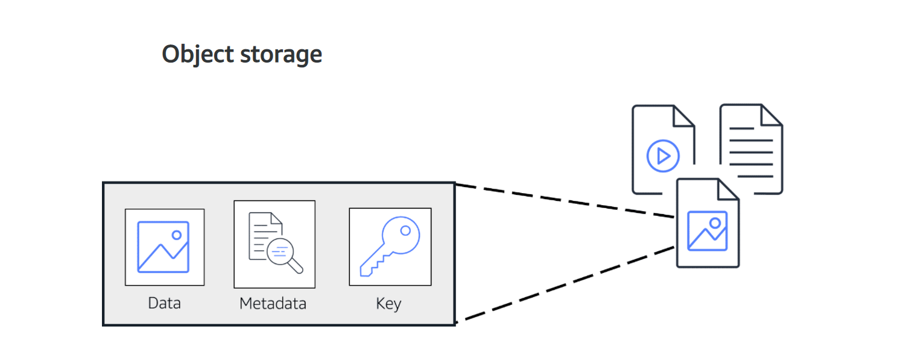
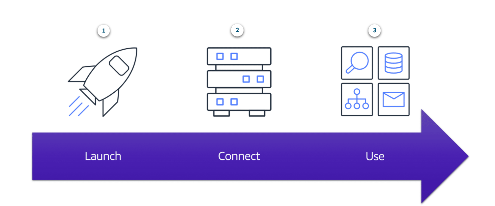
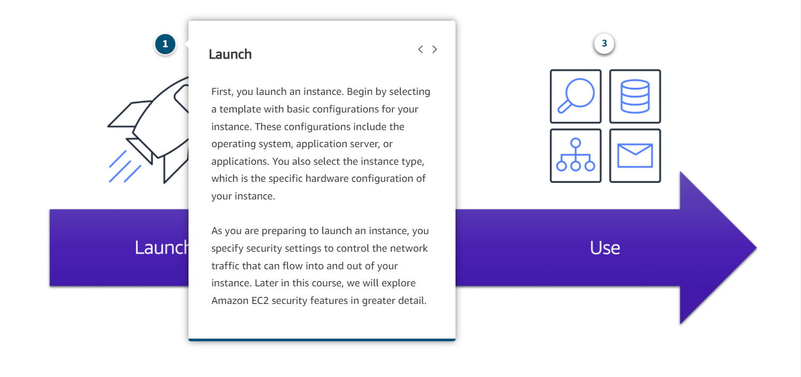
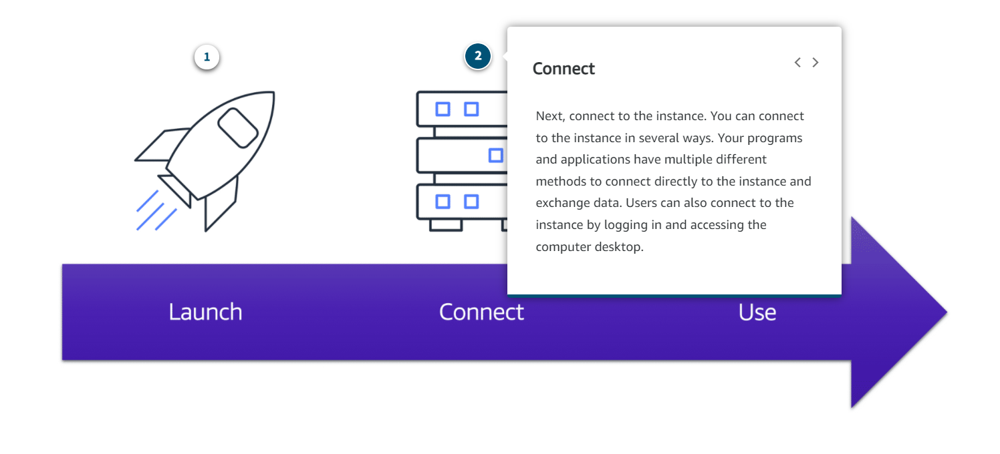
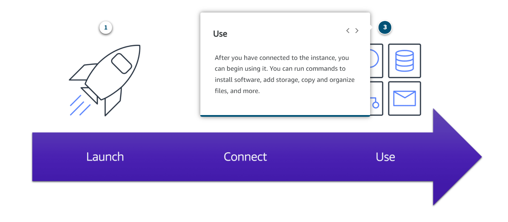
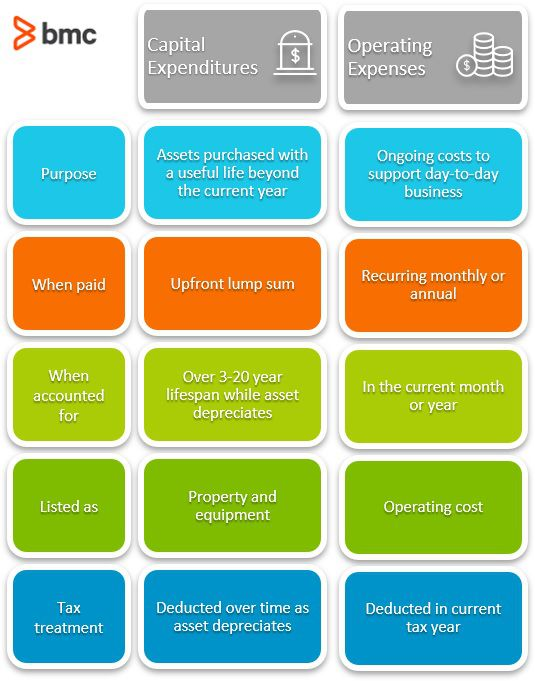

# AWS Pricing

Een van de belangrijkste redenen om over te stappen naar de cloud zijn de kosten. Als het goed wordt gedaan, kunnen openbare cloudinfrastructuren de kosten aanzienlijk verlagen in vergelijking met traditionele datacenters. Dit wordt gedaan door gebruik te maken van een pay-as-you-go-prijsmodel

## Key-terms

- Pay-as-you-go:

Voor elke service betaalt de klant precies de hoeveelheid resources die daadwerkelijk word gebruikt, zonder dat hiervoor langdurige contracten of complexe licenties nodig zijn.

- Save when you reserve:

Sommige services bieden reserveringsopties die een aanzienlijke korting opleveren in vergelijking met prijzen voor on-demand instances.

- Pay less when using more:

Sommige services bieden Tierd-Pricing, dus de kosten per eenheid worden steeds lager naarmate het gebruik toeneemt.
Bijvoorbeeld hoe meer Amazon S3-opslagruimte word gebruikt, hoe minder de klant ervoor betaalt per GB.

- Pay less as AWS grows

Naarmate AWS groeit, richten ze zich meer op het verlagen van de hardwarekosten van het datacenter, het verbeteren van de operationele efficiëntie, het verlagen van het stroomverbruik en de kosten van zakendoen.

## Opdracht

- The four advantages of the AWS pricing model:

        Pay for what you use
        Pay less when youreserve
        Pay less with volume-based discounts when you use more

- AWS free tier:

Met AWS free tier maakt het mogelijk om bepaalde diensten gratis uit proberen en er zijn 3 verschillende free tiers binnen AWS:

        Always free
        12 Months free
        Trials

- S3:

Amazon Simple Storage Service, of S3 is een data storage om data's van een bedrijf op te slaan zoals foto's, Excel sheets en text files.
Data word opgeslagen als "BUCKETS" inplaats van als objecten.
Het is mogelijk om objecten te uploaden tot maximum 5TB. Het is ook mogelijk om version Object te gebruiken om de vorige versie van een object op te slaan zodat data niet volledig kwijt kunnen raken.

AWS heeft 6 verschillende S3's:

S3 Standard:

 * Ontworpen voor veelgebruitke gegevens
 * Slaat gegevens op in minimaal drie Beschikbaarheidszones

 S3 Standard biedt hoge beschikbaarheid voor objecten. Dit maakt het een goede keuze voor een breed scala aan gebruiksscenario's, zoals websites, inhoudsdistributie en gegevensanalyse. S3 Standard heeft hogere kosten dan andere opslagklassen die bedoeld zijn voor weinig gebruikte gegevens en archiefopslag.

S3 Standard-Infrequent Acccess (S3 Standard-IA):

 * Ideaal voor weinig gebruikte gegevens
 * Similar to S3 Standard but has a lower storage price and higher retrieval price

S3 Standard-IA is ideaal voor gegevens die niet vaak worden gebruikt, maar vereist hoge beschikbaarheid wanneer dat nodig is. Zowel S3 Standard als S3 Standard-IA slaan gegevens op in minimaal drie beschikbaarheidszones. S3 Standard-IA biedt hetzelfde beschikbaarheidsniveau als S3 Standard, maar met een lagere opslagprijs en een hogere ophaalprijs.

S3 One Zone -Infrequent Access (S3 One Zone-IA):

 * Slaat gegevens op in een enkele beschikbaarheidszone
 * Heeft een lagere opslagprijs dan S3 Standard-IA

 In vergelijking met S3 Standard en S3 Standard-IA, die gegevens opslaan in minimaal drie beschikbaarheidszones, slaat S3 One Zone-IA gegevens op in één enkele beschikbaarheidszone. Dit maakt het een goede bewaarklasse om te overwegen of de volgende voorwaarden van toepassing zijn:

  * U wilt kosten besparen op opslag.
  * U kunt uw gegevens eenvoudig reproduceren in het geval van een storing in de beschikbaarheidszone.

S3 Intelligent-Tiering:

 * Ideaal voor gegevens met onbekende of veranderende toegangspatronen.
 * Requires a small monthly monitoring and automation fee per object.

 In de S3 Intelligent-Tiering-opslagklasse bewaakt Amazon S3 de toegangspatronen van objecten. Als je een object 30 opeenvolgende dagen niet hebt geopend, verplaatst Amazon S3 het automatisch naar de laag met zeldzame toegang, S3 Standard-IA. Als u een object in de laag met weinig toegang opent, verplaatst Amazon S3 het automatisch naar de laag met frequente toegang, S3 Standard.

S3 Glacier:

 * Voordelige opslag ontworpen voor gegevensarchivering
 * In staat om objecten binnen enkele minuten tot uren op te halen

 S3 Glacier is een goedkope opslagklasse die ideaal is voor gegevensarchivering. U kunt deze opslagklasse bijvoorbeeld gebruiken om gearchiveerde klantrecords of oudere foto's en videobestanden op te slaan.

S3 Glacier Deep Archive:

 * Voordelige objectopslagklasse, ideaal voor archivering
 * In staat om objecten binnen 12 uur op te halen

 Overweeg bij het kiezen tussen Amazon S3 Glacier en Amazon S3 Glacier Deep Archive hoe snel u gearchiveerde objecten moet ophalen. U kunt objecten die zijn opgeslagen in de S3 Glacier-opslagklasse binnen enkele minuten tot enkele uren ophalen. Ter vergelijking: u kunt objecten die zijn opgeslagen in de S3 Glacier Deep Archive-opslagklasse binnen 12 uur ophalen.

EC2:

Amazon Elastic Compute Cloud (Amazon EC2).

Het idee van EC2 is, om on-premises te vervangen voor bepaalde bedrijven. stel je runt een bedrijf dan zul je servers nodig hebben om het bedrijf en de applicaties online en toegankelijk voor jou klanten. dan heb je fysieke computers/servers nodig om toepassingen te hosten en de nodigheden te bieden die jou bedrijf nodig heeft. Als je met AWS werkt, zijn die servers virtueel. En de dienst die je gebruikt om toegang te krijgen tot virtuele servers heet EC2.

CapEx & OpEx:

  * CapEx wordt gedefinieerd als bedrijfskosten die worden gemaakt om in de toekomst langetermijnvoordelen te creëren, zoals de aankoop van vaste activa zoals een gebouw of uitrusting.
  * OpEx zijn uw bedrijfskosten, de uitgaven voor de dagelijkse gang van zaken, zoals diensten en verbruiksartikelen die opraken en naar verbruik worden betaald.

 

### Gebruikte bronnen

- https://aws.amazon.com/s3/storage-classes/
- https://d0.awsstatic.com/whitepapers/aws_pricing_overview.pdf

### Ervaren problemen

Geen problemen, alle nodige informatie waren makkelijk te vinden.

### Resultaat

Om de opdracht af te maken en te begrijpen wat ik aan het doen ben moet ik heel veel lezen. Ik heb geprobeerd om zo veel mogelijk in eigen woorden te schrijven wat de betekenis is van bepaalde termen en diensten en dat is hier boven te zien.
