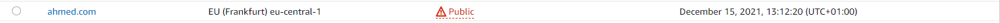

# Simple Storage Service (S3)

AWS biedt objectgebaseerde opslag in de vorm van S3. S3 maakt gebruik van buckets als container voor objecten. Een enkel object in S3 heeft een maximale grootte van 5TB. De totale grootte van een bucket is echter vrijwel onbeperkt.

## Opdracht 1

- Start your sandbox lab and open the AWS console.
- Navigate to the S3 menu.
- Create new bucket with the following requirements:
- Region: Frankfurt (eu-central-1)
- Public access enabled
- Upload a cat picture to your bucket.
- Share the object URL of your cat picture with a peer. Make sure they are able to see the picture.

https://catje.s3.eu-central-1.amazonaws.com/kat.jpg

## Opdracht 2

- Create new bucket with the following requirements:
- Region: Frankfurt (eu-central-1)
- Public access enabled
- Upload the four files that make up AWS’ demo website.
- Enable static website hosting.
- Share the bucket website endpoint with a peer. Make sure they are able to see the website.

### Gebruikte bronnen

https://docs.aws.amazon.com/AmazonS3/latest/userguide/UsingBucket.html

### Ervaren problemen

Geen

### Resultaat

Om de opdracht af te maken en te begrijpen wat ik aan het doen ben moest ik heel veel lezen. Resultaat is hier boven te zien.
