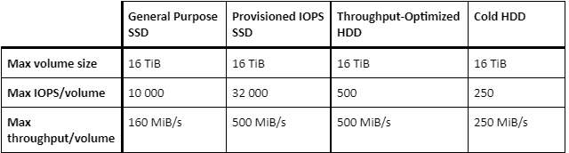
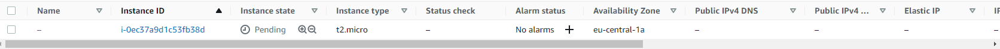
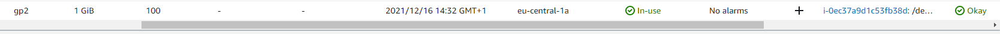
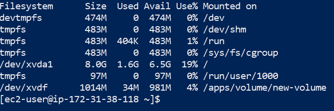
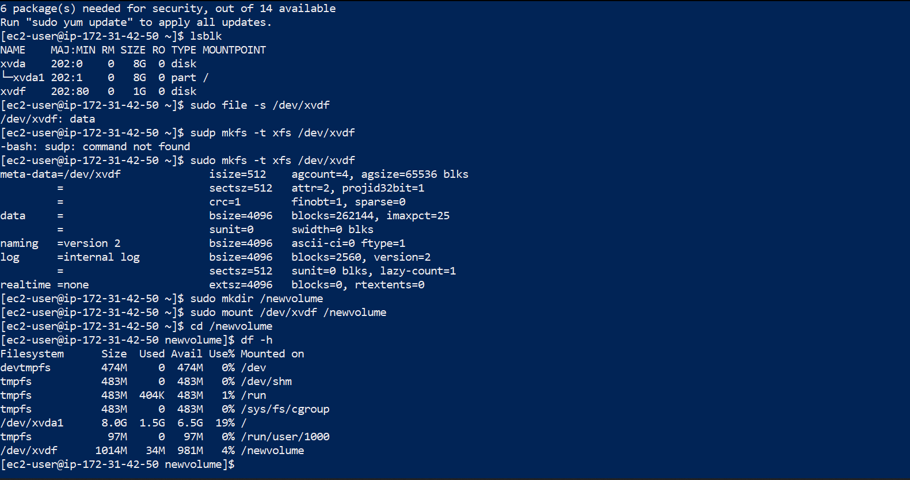
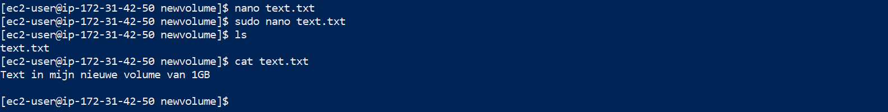
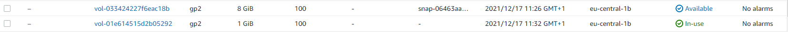

# Elastic Block Store (EBS)

EBS kan worden gezien als virtuele hard DRIVES in de cloud. Dit kunnen root volumes zijn (zoals een interne hard drive), of afzonderlijke volumes (zoals een externe harde schijf). Een exemplaar van een EBS wordt een volume genoemd. Eén volume kan slechts aan één EC2-instantie tegelijk worden gekoppeld, hoewel u voor elk non-root volume het kunt loskoppelen en aan een andere EC2-instantie kunt koppelen.

## Opdracht 1

- Start your sandbox lab and open the AWS console.
- Navigate to the EC2 menu.
- Create a t2.micro Amazon Linux 2 machine with all the default settings (the key can be downloaded from the sandbox lab)

- Create a new EBS volume with the following requirements:
    - Volume type: General Purpose SSD (gp2)
    - Size: 1 GiB
    - Availability Zone: same as your EC2

- Wait for its state to be available.

## Opdracht 2

- Attach your new EBS volume to your EC2 instance.

- Connect to your EC2 instance using SSH.
- Mount the EBS volume on your instance.
- Create a text file and write it to the mounted EBS volume.

## Opdracht 3

- Create a snapshot of your EBS volume.
- Remove the text file from your original EBS volume.
- Create a new volume using your snapshot.
- Detach your original EBS volume.
- Attach the new volume to your EC2 and mount it.
- Find your text file on the new EBS volume.

### Gebruikte bronnen

- https://devopscube.com/mount-ebs-volume-ec2-instance/

### Ervaren problemen

In het begin had ik problemen gehad met het verbinden met mijn instance. Uiteindelijk heb ik het probleem gevonden, het had geen internet gateway en dat had ik moeten maken, Elastic IP aanmaken en allemaal toevoegen aan mijn instance om verder te kunnen met de rest van de opdrachten.

### Resultaat

Resultaat is boven te zien.
