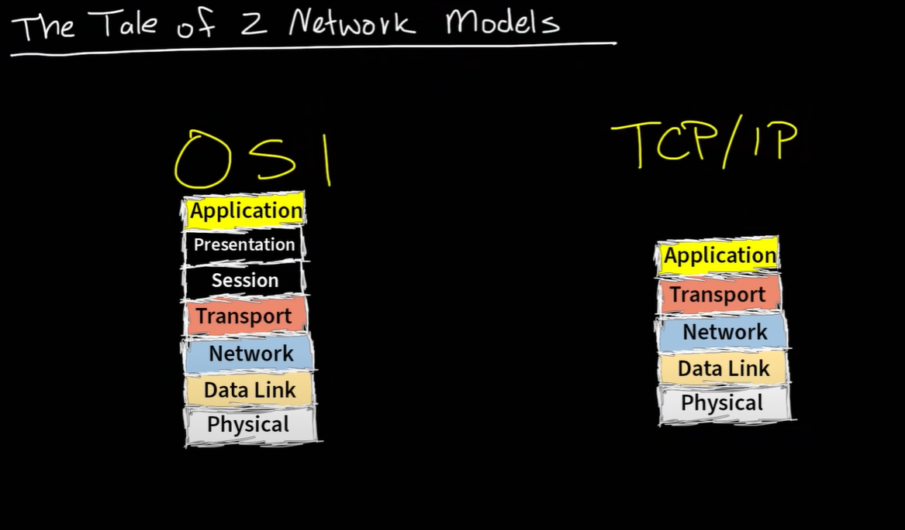
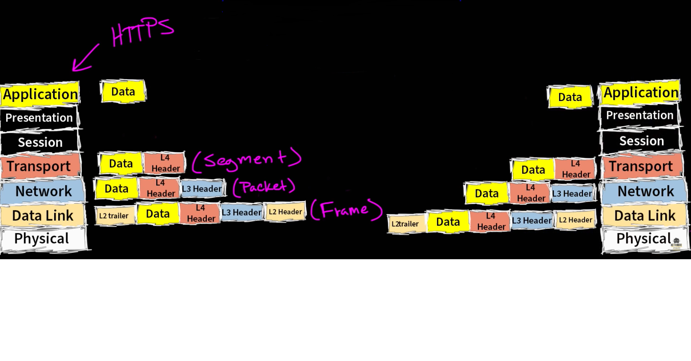

# Protocols

Een netwerk protocol is een afspraak die wij mensen gemaakt hebben over hoe computers met elkaar communiceren. Deze afspraken maken het mogelijk dat het Internet kan bestaan, zonder dat je voor iedere verbinding een andere standaard moet aanhouden.
Het OSI-model is een goed hulpmiddel om te beschrijven waar een protocol ‘leeft’ en wat het doel is van een protocol. Vaak genoeg ‘leeft’ een protocol in meerdere lagen van het OSI-model.

## Opdracht

- Begrijp hoe een HTTPS TCP/IP-pakket opgebouwd is:

Hypertext Transfer Protocol (HTTP) is een application layer protocol. HTTP gebruikt TCP/IP protocol om de website op je browser te kunnen zien.
TCP/IP en OSI protocol bestaat uit lagen en beide protocolen zijn bijna het zelfde, TCP/IP en OSI protocol gebruiken beide 7 lagen om data te transferen. OSI maakt gebruik van lagen 5 en 6 maar TCP/IP maakt geen gebruik van lagen 5 en 6.

- Begrijp wie bepaalt welke protocols wij gebruiken en wat je zelf moet doen om een nieuw protocol te introduceren.

Bedrijven en developers

- Identificeer op zijn minst één protocol per OSI-laag.

Presentation (Layer 6):

Zorgen dat data gepresenteerd kan worden. Presentation lagen kan gebruik maken van verschillende protocolen zoals: AFP, LPP, NCP, NDR, XDR. Met dit protocolen maakt get mogelijk om filetypes te kunnen zien en lezen, zoals .PDF of .JPG.

    

- Facebook was recent een lange tijd niet beschikbaar. Ontdek waarom. Tip: BGP.

BGP: Border Gateway Protocol is het belangrijkste routeringsprotocol van het internet: het wordt gebruikt om verkeer tussen verschillende providers te routeren. BGP is te vinden in Laag 4 (Transport).

Door een configuratiewijzigingen met betrekking tot BGP waardoor routers van internetproviders geen toegang hadden om de data te ontvangen.

### Gebruikte bronnen
[Plaats hier de bronnen die je hebt gebruikt.]

### Ervaren problemen
[Geef een korte beschrijving van de problemen waar je tegenaan bent gelopen met je gevonden oplossing.]

### Resultaat
[Omschrijf hoe je weet dat je opdracht gelukt is (gebruik screenshots waar nodig).]