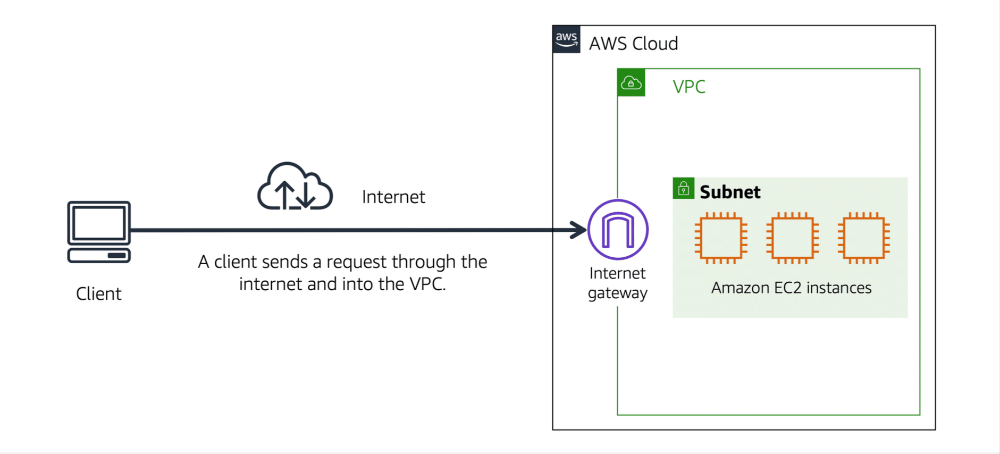
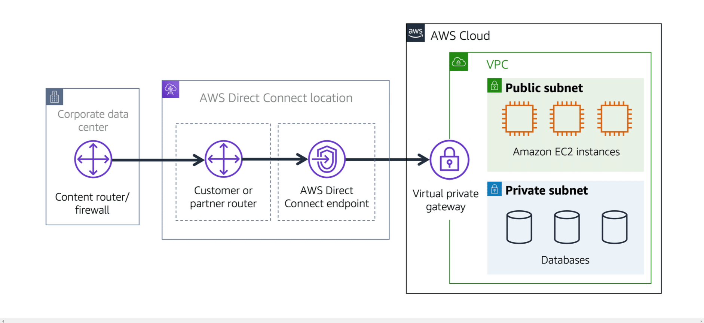
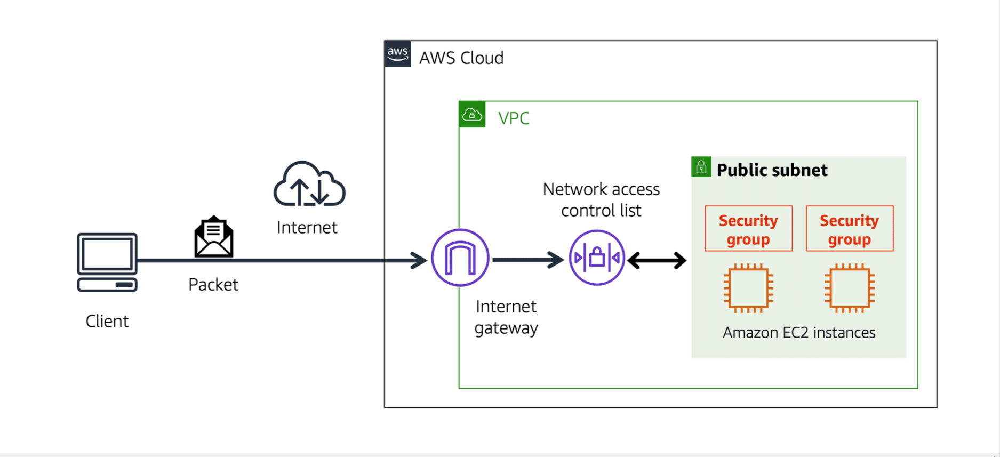

# Security Groups

Security Groups zijn stateful virtuele firewalls die aan instance kunnen worden toegewezen. Ze draaien niet in het besturingssysteem, maar in de Amazon Virtual Private Cloud (VPC). Eén Security Group kan aan meerdere instance worden toegewezen. Omgekeerd kan één instance maximaal 5 Security Group hebben.
Security Group hebben alleen Allow Rules. Alles wat niet expliciet is toegestaan, wordt automatisch impliciet geweigerd.

Een Network Access Control List (NACL) is een stateless firewall die op subnet niveau in een VPC draait.
Een NACL heeft zowel expliciete regels voor toestaan als weigeren. Aan regels is een nummer toegewezen. Dit nummer geeft de volgorde aan waarin de regels worden toegepast.
Bij standaard is een NACL geconfigureerd om al het verkeer in en uit het netwerk toe te staan.

## Key-terms

- Amazon Virtual Private Cloud (VPC): Binnen een virtual private cloud (VPC) kan je resources indelen in subnetten. Een subnet is een sectie van een VPC die bronnen kan bevatten, zoals Amazon EC2-instanties.

- Internet gateway: Om openbaar verkeer van het internet toegang te geven aan de VPC. De Internet Gateway word aangesloten op de VPC.

- Virtual private gateway: Om toegang prive toegang te geven aan de VPC. Je blijft zelfde verkeer nemen als de andere gebruikers maar met extra beveiliging laag.

- AWS Direct Connect: een service waarmee een speciale privéverbinding tot stand kunt brengen tussen jou datacenter en een VPC.

- Network access control lists (ACLs): Elk AWS-account bevat een standaard netwerk-ACL. Bij het configureren van een VPC kunt je de standaard netwerk-ACL van een account gebruiken of aangepaste netwerk-ACL's maken.

Standaard staat ACL van een account al het inkomende en uitgaande verkeer toe, maar je kan dit wijzigen door eigen regels toe te voegen. Voor aangepaste netwerk-ACL's wordt al het inkomende en uitgaande verkeer geweigerd totdat de regels toevoegt om op te geven welk verkeer moet worden toegestaan. Bovendien hebben alle netwerk-ACL's een expliciete weigerregel. Deze regel zorgt ervoor dat als een packet niet overeenkomt met een van de andere regels op de lijst, het packet wordt geweigerd.

## Study Security Groups

- Security group, Is een Virtuele Firewall om internet verkeer te controleren en te "verminderen" om zo veilig mogelijk te maken.

### Gebruikte bronnen

- https://explore.skillbuilder.aws/learn/course

### Ervaren problemen

Geen

### Resultaat

Door gebruik maken van de AWS Skill builder heb ik heel veel geleerd en ook toegepast aan mijn EC2 om precies te begrijpen hoe alles werkt en beter begrijp.
