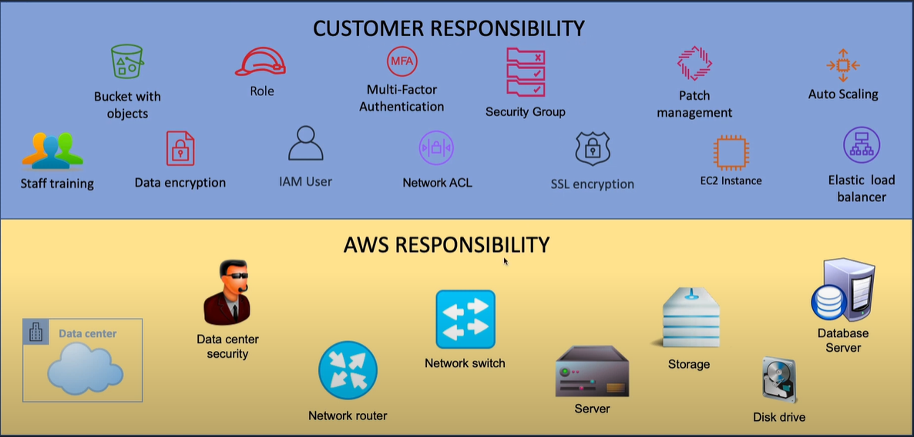

# Shared Responsibility Model

Security en Compliance is een gedeelde verantwoordelijkheid tussen AWS en de klant. Dit gedeelde model kan de operationele last van de klant helpen verlichten, aangezien AWS de componenten van het hostbesturingssysteem en de virtualisatielaag tot aan de fysieke beveiliging van de faciliteiten waarin de service actief is, bedient, beheert en controleert. De klant neemt de verantwoordelijkheid en het beheer van het gastbesturingssysteem (inclusief updates en beveiligingspatches), andere bijbehorende applicatiesoftware en de configuratie van de door AWS geleverde beveiligingsgroepfirewall op zich. Klanten moeten zorgvuldig nadenken over de services die ze kiezen, aangezien hun verantwoordelijkheden variëren afhankelijk van de gebruikte services, de integratie van die services in hun IT-omgeving en toepasselijke wet- en regelgeving. De aard van deze gedeelde verantwoordelijkheid zorgt ook voor de flexibiliteit en klantcontrole die de implementatie mogelijk maken. Zoals te zien is in de onderstaande grafiek, wordt deze differentiatie van verantwoordelijkheid gewoonlijk aangeduid als Beveiliging "van" de cloud versus beveiliging "in" de cloud.

## Key-Terms

- Inherited Controls: Bepaalt welke een klant volledig erft van AWS.

