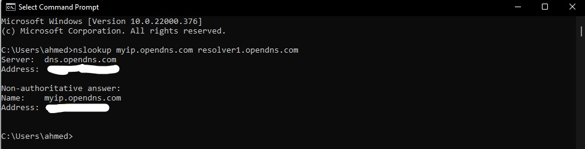
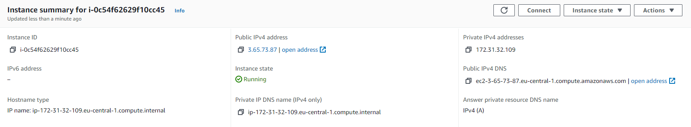
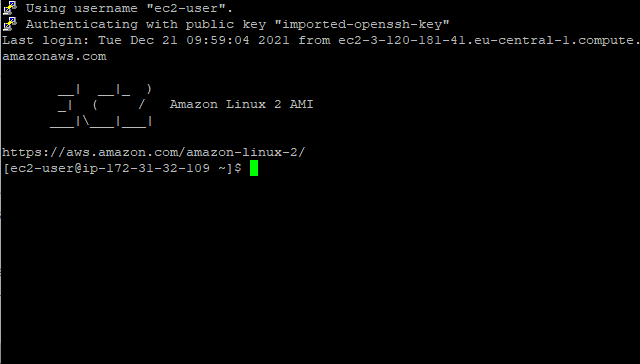
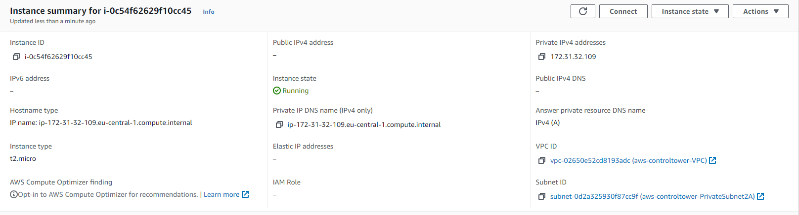
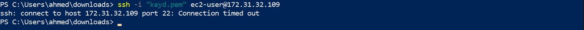

# IP Adressen

Je internetprovider kent een numeriek label toe, het IP-adres (Internet Protocol), om jouw apparaat te identificeren tussen miljarden anderen. In zekere zin functioneert een IP-adres als een online huisadres, omdat apparaten IP's gebruiken om elkaar te vinden en met elkaar te communiceren.

Hier lees je hoe een IP-adres gegevens naar hun bestemming leidt. Eerst typ je een websitenaam (voorbeeld.com) in de browser. Je computer verstaat echter geen woorden, alleen cijfers. Dus het ontdekt eerst het IP-adres van die website (voorbeeld.com = 103.86.98.1.), vindt het op internet en laadt het uiteindelijk op jouw scherm.

## Opdracht

- Ontdek wat je publieke IP adres is van je laptop en mobiel op wifi

    Ik heb de volgende command gebruikt in CMD om de publieke IP te achterhalen.

        nslookup myip.opendns.com resolver1.opendns.com

    Zo te zien in de screenshot ↓. 
    Bij "Non-authoritative answer":

        - Name: myip.opendns.com

        - Address: Is mijn publieke IP Adress.

Het is mogelijk om te zoeken in de google search:

    "What is my ip adress?".

Dan krijg je het resultaat uit een websites of vanuit google zelfs. zoals: https://nordvpn.com/nl/what-is-my-ip/

- Ontdek wat je publieke IP adres is op je mobiel via mobiel internet (als mogelijk)

- Maak een VM in je cloud met een publiek IP. Maak verbinding met deze VM.

- Verwijder het publieke IP adres van je VM. Begrijp wat er gebeurt met je verbinding.

### Gebruikte bronnen

- https://support.google.com/websearch/answer/1696588

### Ervaren problemen
Geen

### Resultaat

Door vorige opdrachten wist ik precies wat ik allemaal moest doen zonder hulp van bronnen. Resultaat is hier boven te zien.
