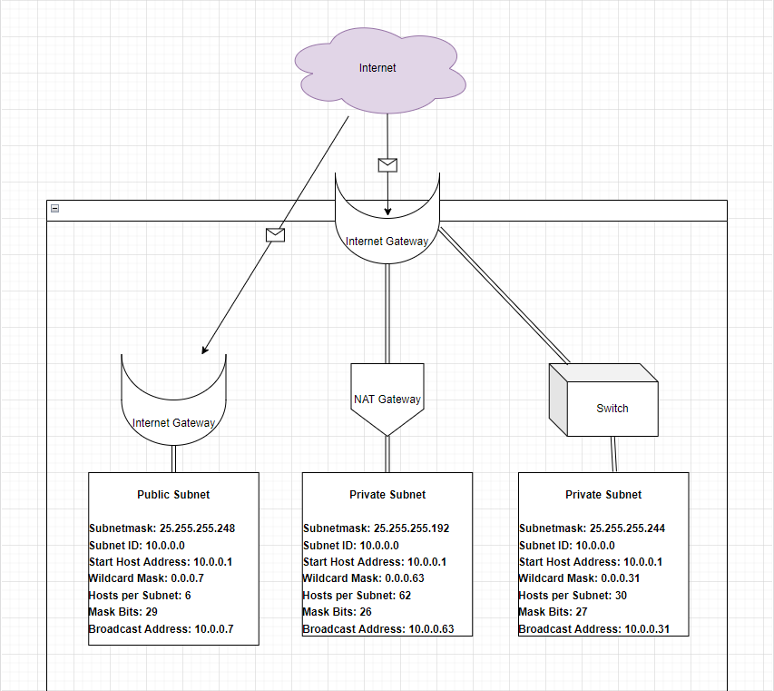

# Subnetting

Een netwerk is gedefinieerd als twee of meer devices die met elkaar verbonden zijn zodat ze data kunnen uitwisselen. Een Local Area Network (LAN) wordt vaak uitgedrukt als een range aan IP addresses. Elk device (host) krijgt een eigen adres binnen die range.
Om dit te ondersteunen hebben netwerken een subnet mask (prefix) die definieert hoeveel bits van het IP adres onderdeel uitmaken van het netwerkadres, en hoeveel bits gereserveerd zijn voor de host.
Een subnet is een kleiner netwerk dat onderdeel is van een groter netwerk. Subnets kunnen worden gebruikt om een deel van het netwerk logisch te isoleren. Een subnet heeft per definitie een grotere prefix dan het netwerk waar het subnet in zit.
Om dit alles leesbaar te maken voor mensen maken we gebruik van CIDR notation.

## Key-terms
[Schrijf hier een lijst met belangrijke termen met eventueel een korte uitleg.]

## Opdracht

- Maak een netwerkarchitectuur die voldoet aan de        volgende eisen:
    
    - 1 private subnet dat alleen van binnen het LAN bereikbaar is. Dit subnet moet minimaal 15 hosts kunnen plaatsen.

    - 1 private subnet dat internet toegang heeft via een NAT gateway. Dit subnet moet minimaal 30 hosts kunnen plaatsen (de 30 hosts is exclusief de NAT gateway).
    - 1 public subnet met een internet gateway. Dit subnet moet minimaal 5 hosts kunnen plaatsen (de 5 hosts is exclusief de internet gateway).

- Plaats de architectuur die je hebt gemaakt inclusief een korte uitleg in de Github repository die je met de learning coach hebt gedeeld.

### Gebruikte bronnen

- https://www.youtube.com/watch?v=ecCuyq-Wprc&t=383s
- https://explore.skillbuilder.aws/learn/course/

### Ervaren problemen

Geen

### Resultaat

Subnetting is een van belangrijkste onderwerpen om Networking concept volledig te begrijpen. Het is belangrijk om bassis kennis te hebben over Netwerk om dit opdracht correct te maken.

Het resultaat is hier boven te zien ↑.
