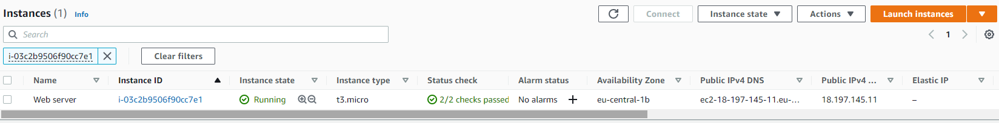
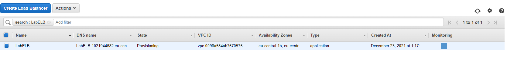
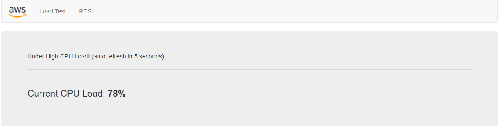

# Elastic Load Balancing (ELB) & Auto Scaling

One of the main advantages of the cloud is that you don’t need to guess how much capacity you need. You can always scale up and down with on-demand services. One of the services that enables this is called Auto Scaling.When you run an application with a spiky workload, you can host the application on a fleet of EC2 instances instead of a single server. When the demand for the application is high, Auto Scaling can automatically add instances to the fleet. When the demand is lower, it can similarly remove instances. To make sure all servers are the same, Auto Scaling makes use of a (custom) AMI. Auto Scaling makes use of CloudWatch metrics to determine whether to add or remove instances.
In a traditional architecture, a client connects to a single server with a single IP address. When dealing with a fleet of servers, this would not work. Therefore, a load balancer can be introduced as a connection endpoint for the client. The load balancer will forward the request to one of the servers in the fleet, and relay the response back to the client.

AWS’ ELB services is a managed service that provides load balancing to a fleet of instances. There are three types of ELBs:

- Application Load Balancer: this ELB works using HTTP and HTTPS protocols (layer 7 of the OSI stack).
- Network Load Balancer: this ELB works using TCP and UDP (layer 4 of the OSI stack).
- Classic Load Balancer: this ELB is outdated and not recommended for use. AWS has (so far) never stopped supporting any services. The reason for this is that it can harm existing applications.

## Key-terms

## Opdracht 1

- Launch an EC2 instance with the following requirements:
    - Region: Frankfurt (eu-central-1)
    - AMI: Amazon Linux 2
    - Type: t3.micro
    - User data:

        #!/bin/bash
        # Install Apache Web Server and PHP
        yum install -y httpd mysql php
        # Download Lab files
        wget https://aws-tc-largeobjects.s3.amazonaws.com/CUR-TF-100-RESTRT-1/80-lab-vpc-web-server/lab-app.zip
        unzip lab-app.zip -d /var/www/html/
        # Turn on web server
        chkconfig httpd on
        service httpd start
        Security Group: Allow HTTP

- Wait for the status checks to pass.

- Create an AMI from your instance with the following requirements:
    - Image name: Web server AMI

## Opdracht 2

- Create an application load balancer with the following requirements:
    - Name: LabELB
    - Listener: HTTP on port 80
    - AZs: eu-central-1a and eu-central-1b
    - Subnets: must be public
- Security Group: 
    - Name: ELB SG
    - Rules: allow HTTP access
- Target Group:
    - Name: LabTargetGroup
    - Targets: to be registered by Auto Scaling

## Opdracht 3

- Create a launch configuration for the Auto Scaling group. It has to be identical to the server that is currently running.
- Create an auto scaling group with the following requirements:

    - Name: Lab ASG
    - Launch Configuration: Web server launch configuration
    - Subnets: must be in eu-central-1a and eu-central-1b
    - Load Balancer: LabELB
    - Group metrics collection in CloudWatch must be enabled
- Group Size:
    - Desired Capacity: 2
    - Minimum Capacity: 2
    - Maximum Capacity: 4
- Scaling policy: Target tracking with a target of 60% average CPU utilisation

## Opdracht 4

- Verify that the EC2 instances are online and that they are part of the target group for the load balancer.
- Access the server via the ELB by using the DNS name of the ELB.
- Perform a load test on your server(s) using the website on your server to activate auto scaling. There might be a delay on the creation of new servers in your fleet, depending on the settings on your Auto Scaling Group.

## Gebruikte bronnen

Geen

## Ervaren problemen

Geen

## Resultaat

Na het volgen van alle stappen is het mij in een gelukt om verbinding te maken met de ELB en de load test te starten.

Resultaat is hier boven te zien. ↑↑↑
