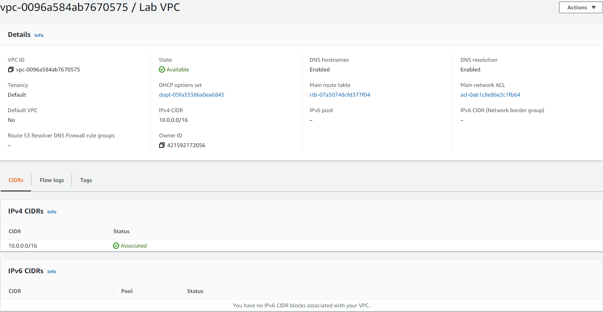
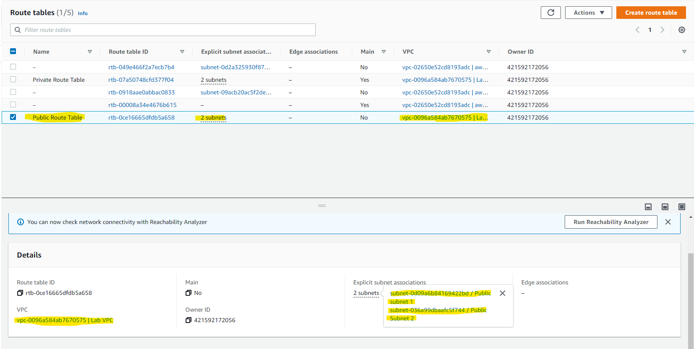

# Virtual Private Cloud (VPC)

Amazon VPC is typically described as a virtual private data center in the cloud. It is a virtual network that is logically isolated from other VPCs.
With a VPC you have full control over the design of the network. You can create subnets, internet gateways (igw), NAT gateways, VPN connections, and more.
There is always a default VPC when you create a new AWS account, but you can add up to 5 non-default VPCs per region per account. This is a soft limit. That is, you can request the limit to be raised.
Many services, like EC2, RDS and ECS require a VPC to be placed into.
When you create a VPC, you must assign a CIDR block. Choose your CIDR block and subnet mask carefully, as they have to allow for enough subnets and hosts and cannot be changed after creation. Subnets can be either public or private. The only difference is that private subnets do not have an entry for the internet gateway (igw) in their route table, where public subnets do. In other words, private subnets cannot access the internet without a NAT gateway or a NAT instance. VPCs operate at the regional level, while subnets can only be placed into a single Availability Zone.
Elastic IPs are also available from the VPC menu. EIPs are public IP addresses that can be dynamically allocated to resources like EC2 instances or NAT gateways.

## Key-terms
[Schrijf hier een lijst met belangrijke termen met eventueel een korte uitleg.]

## Opdracht 1

- Navigate to the VPC menu in your sandbox environment.
- Allocate an Elastic IP address to your account.
- Use the Launch VPC Wizard option to create a new VPC with the following requirements:

    - Region: Frankfurt (eu-central-1)
    - VPC with a public and a private subnet
    - Name: Lab VPC
    - CIDR: 10.0.0.0/16

- Requirements for the public subnet:
    - Name: Public subnet 1
    - CIDR: 10.0.0.0/24
    - AZ: eu-central-1a

- Requirements for the private subnet:

    - Name: Private subnet 1
    - CIDR: 10.0.1.0/24
    - AZ: eu-central-1a

- View the main route table for Lab VPC. It should have an entry for the NAT gateway. Rename this route table to Private Route Table.

- Explicitly associate the private route table with your two private subnets.

### Gebruikte bronnen
[Plaats hier de bronnen die je hebt gebruikt.]

### Ervaren problemen
[Geef een korte beschrijving van de problemen waar je tegenaan bent gelopen met je gevonden oplossing.]

### Resultaat
[Omschrijf hoe je weet dat je opdracht gelukt is (gebruik screenshots waar nodig).]
