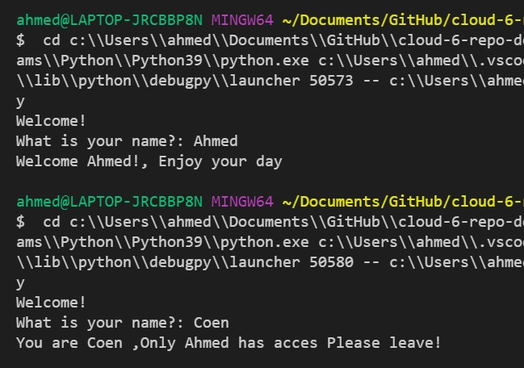

# Conditions
Very often, you will want to run a piece of code only when certain conditions are met. For example, you might want to write something to an error log only if an error occurred.
Python makes use of the if, elif, and else statements.

## Opdracht 1
- Create a new script.
- Use the input() function to ask the user of your script for their name. If the name they input is your name, print a personalized welcome message. If not, print a different personalized message.

            print("Welcome!")
            name = str(input("What is your name?: "))

            if name == "Ahmed":
                print("Welcome Ahmed!, Enjoy your day")
            else:
                print("You are " + name + " ,Only Ahmed has acces Please leave!")

## Opdracht 2

- Create a new script.
- Ask the user of your script for a number. Give them a response based on whether the number is higher than, lower than, or equal to 100.
- Make the game repeat until the user inputs 100.

        x = 100
        while x:
            guess = int(input("Guess a number: "))
                if guess < x:
                    print(guess, "is pretty low")
                if guess > x:
                    print(guess, "is pretty high")
                if guess == x:
                    print(guess, "is the right number!")
                    break